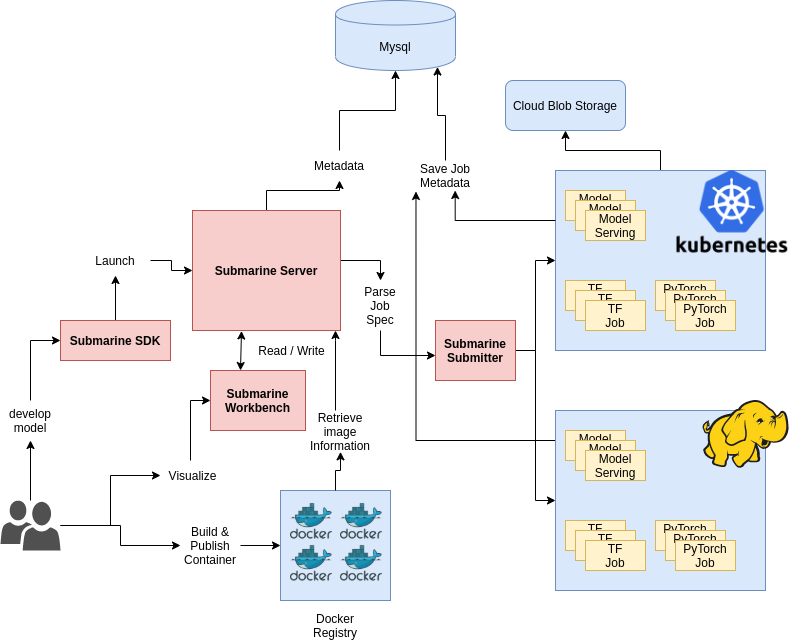
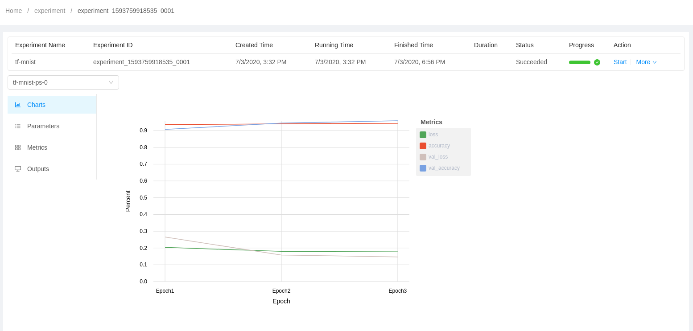

<!---
  Licensed under the Apache License, Version 2.0 (the "License");
  you may not use this file except in compliance with the License.
  You may obtain a copy of the License at

   http://www.apache.org/licenses/LICENSE-2.0

  Unless required by applicable law or agreed to in writing, software
  distributed under the License is distributed on an "AS IS" BASIS,
  WITHOUT WARRANTIES OR CONDITIONS OF ANY KIND, either express or implied.
  See the License for the specific language governing permissions and
  limitations under the License. See accompanying LICENSE file.
-->


#### **Table of Contents**
- [What is Hadoop Submarine? ](#what-is-hadoop-submarine)
- [Architecture](#architecture)
- [hello-submarine](#hello-submarine)
    - [Prerequisites](#prerequisites)  
    - [Before you start it, you need to know](#before-you-start-it-you-need-to-know)
    - [mini-submarine (submarine in docker)](#mini-submarine-submarine-in-docker)
    - [Submarine On Kubernetes](#submarine-on-kubernetes)
    - [Submarine On Hadoop](#submarine-on-hadoop)
# What is Hadoop Submarine? 

Submarine is a new subproject of Apache Hadoop.

Submarine is a project which allows infra engineer / data scientist to run
*unmodified* Tensorflow or PyTorch programs on YARN or Kubernetes.

Goals of Submarine:
- It allows jobs easy access data/models in HDFS and other storages.
- Can launch services to serve Tensorflow/PyTorch models.
- Support run distributed Tensorflow jobs with simple configs.
- Support run user-specified Docker images.
- Support specify GPU and other resources.
- Support launch tensorboard for training jobs if user specified.
- Support customized DNS name for roles (like tensorboard.$user.$domain:6006)

# Architecture



- workbench 

# hello-submarine 

There is no complete and **easy** to understand example for beginner, and 
Submarine support many open source infrastructure, it's hard to deploy each runtime 
environment for engineer, not to mention data sciences

This repo is aim to let user easily deploy container orchestrations (like Hadoop Yarn, k8s) by 
docker container, support full distributed deep learning example for each runtimes, and
step by step tutorial for beginner.

## Prerequisites
- Ubuntu 18.04+
- Docker
- Memory > 8G

## Before you start it, you need to know 
- [Hadoop](https://hadoop.apache.org/)
- [Kubernetes](https://kubernetes.io/docs/concepts/overview/what-is-kubernetes/)
- [Tensorflow](https://www.tensorflow.org/)
- [Pytorch](https://pytorch.org/)
- [Docker](https://www.docker.com/)

## mini-submarine (Submarine in docker)
A fast and easy way to deploy Submarine on your laptop.

With just a few clicks, you are up for experimentation,
 and for running complete Submarine experiment.
 
mini-submarine includes:
- Standalone Hadoop v2.9.2
- Standalone Zookeeper v3.4.14
- Latest version of Apache Submarine
- TensorFlow example (MNIST handwritten digit)
### Build docker image from local
```bash
docker build --tag hello-submarine .
docker run -it -h submarine-dev --name mini-submarine --net=bridge --privileged -P hello-submarine /bin/bash
```
### Pull image from dockerhub
```bash
docker pull pingsutw/hello-submarine
docker run -it -h submarine-dev --name mini-submarine --net=bridge --privileged -P pingsutw/hello-submarine /bin/bash
```
### Run submarine CTR Library
```bash
pwd # /home/yarn/submarine
. ./venv/bin/activate

# change directory
cd ..
cd tests

# run locally
python run_deepfm.py -conf deepfm.json -task train
python run_deepfm.py -conf deepfm.json -task evaluate
# Model metrics :  {'auc': 0.64110434, 'loss': 0.4406755, 'global_step': 12}

# run distributedly
export SUBMARINE_VERSION=0.5.0-SNAPSHOT
export SUBMARINE_HADOOP_VERSION=2.9
export SUBMARINE_JAR=/opt/submarine-dist-${SUBMARINE_VERSION}-hadoop-${SUBMARINE_HADOOP_VERSION}/submarine-dist-${SUBMARINE_VERSION}-hadoop-${SUBMARINE_HADOOP_VERSION}/submarine-all-${SUBMARINE_VERSION}-hadoop-${SUBMARINE_HADOOP_VERSION}.jar

java -cp $(${HADOOP_COMMON_HOME}/bin/hadoop classpath --glob):${SUBMARINE_JAR}:${HADOOP_CONF_PATH} \
 org.apache.submarine.client.cli.Cli job run --name deepfm-job-001 \
 --framework tensorflow \
 --verbose \
 --input_path "" \
 --num_workers 2 \
 --worker_resources memory=2G,vcores=4 \
 --num_ps 1 \
 --ps_resources memory=2G,vcores=4 \
 --worker_launch_cmd "myvenv.zip/venv/bin/python run_deepfm.py -conf=deepfm_distributed.json" \
 --ps_launch_cmd "myvenv.zip/venv/bin/python run_deepfm.py -conf=deepfm_distributed.json" \
 --insecure \
 --conf tony.containers.resources=../submarine/myvenv.zip#archive,${SUBMARINE_JAR},deepfm_distributed.json,run_deepfm.py
```
## Submarine On Kubernetes
Deploy all component on K8s, including
- Mysql Database
- Submarine Server
- Submarine Workbench
- [tf-operator](https://github.com/kubeflow/tf-operator)
- [pytorch-operator](https://github.com/kubeflow/pytorch-operator)
### Prerequisites
- [Kind](https://github.com/kubernetes-sigs/kind)
- [Kubectl](https://kubernetes.io/docs/tasks/tools/install-kubectl/)
    - [kubectl Cheat Sheet](https://kubernetes.io/docs/reference/kubectl/cheatsheet/)
- [Helm](https://helm.sh/docs/helm/helm_install/)
#### Install Kind (local clusters for testing Kubernetes)
```shell script
curl -Lo ./kind "https://github.com/kubernetes-sigs/kind/releases/download/v0.7.0/kind-$(uname)-amd64"
chmod +x ./kind
mv ./kind /some-dir-in-your-PATH/kind
```
#### Install Kubectl
```shell script
curl -LO https://storage.googleapis.com/kubernetes-release/release/`curl -s https://storage.googleapis.com/kubernetes-release/release/stable.txt`/bin/linux/amd64/kubectl
chmod +x ./kubectl
sudo mv ./kubectl /usr/local/bin/kubectl
kubectl version --client
```
#### Install Helm
```shell script
curl https://helm.baltorepo.com/organization/signing.asc | sudo apt-key add -
sudo apt-get install apt-transport-https --yes
echo "deb https://baltocdn.com/helm/stable/debian/ all main" | sudo tee /etc/apt/sources.list.d/helm-stable-debian.list
sudo apt-get update
sudo apt-get install helm
```
#### Create K8s Cluster
```shell script
kind create cluster --image kindest/node:v1.15.6 --name k8s-submarine
kubectl create namespace submarine
# set submarine as default namspace
kubectl config set-context --current --namespace=submarine
```
#### Deploy Submarine On K8s
```shell script
helm install submarine ./helm-charts/submarine
```
#### Expose submarine server service, so that user can connect submarine workbench
```shell script
kubectl port-forward svc/submarine-server 8080:8080
# open workbench http://localhsot:8080
# Account: admin
# Password: admin
``` 
#### Create a TensorFlow distributed training experiment
```shell script
curl -X POST -H "Content-Type: application/json" -d '
{
  "meta": {
    "name": "tf-mnist-json",
    "namespace": "submarine",
    "framework": "TensorFlow",
    "cmd": "python /var/tf_mnist/mnist_with_summaries.py --log_dir=/train/log --learning_rate=0.01 --batch_size=150",
    "envVars": {
      "ENV_1": "ENV1"
    }
  },
  "environment": {
    "image": "gcr.io/kubeflow-ci/tf-mnist-with-summaries:1.0"
  },
  "spec": {
    "Ps": {
      "replicas": 1,
      "resources": "cpu=1,memory=512M"
    },
    "Worker": {
      "replicas": 1,
      "resources": "cpu=1,memory=512M"
    }
  }
}
' http://127.0.0.1:8080/api/v1/experiment
```
## Submarine On Hadoop
TBD